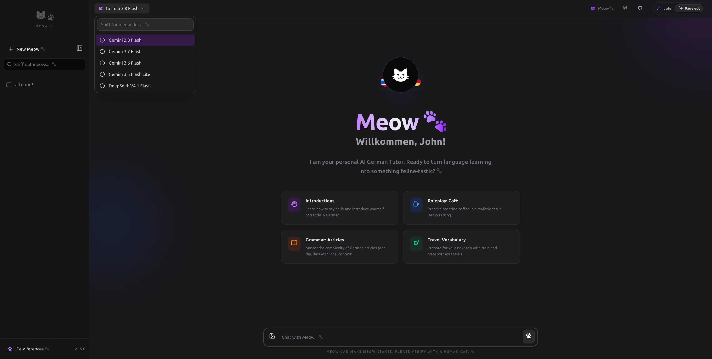

# Meow AI 🐾

[](https://github.com/thaikolja/meow-ai/stargazers) [](https://github.com/thaikolja/meow-ai/network/members) [](https://github.com/thaikolja/meow-ai/issues) [](https://github.com/thaikolja/meow-ai/commits)

**Version 1.5.0.** Do not bump past this until asked.

**Meow AI** is a flexible and cute cat-themed chat interface whose agents help you learn German. Originally programmed
solely for my wife, I decided to open-source it – it's just so cute. *Meow AI* uses mostly **Gemini models**, but you
can customize it and add new providers. API keys are stored in the `.env` file; every chat will be stored in your
browser and not on another server. Based on **Nuxt 4**.

<div align="center">
  
</div>

**Screenshots**: [Chat interface](https://p.ipic.vip/ucbkkz.webp) | [New chat](https://p.ipic.vip/qc7sm7.webp) | [Default model selector](https://p.ipic.vip/t9aa2s.webp) | [Chat](https://p.ipic.vip/0sb66l.webp)

## Project config

`nuxt.config.ts` has a top-level `meo` object. `meo.confetti` is a string, `"yes"` or `"nein"`. `nuxt.schema.ts` types that key. A `modules:done` hook copies it onto public runtime config. `app.vue` prints the value. `"yes"` shows the login confetti. `"nein"` leaves it off. The sidebar shows the package version.

## Highlights

- **Shared-password gate.** The browser signs a one-time challenge. `NUXT_APP_PASSWORD` never leaves the server.
- **Signed session** (`chat_session`) plus a readable `chat_username` cookie, and a logout control.
- **Cat-sentence addresses** such as `/chat/cat-sits-on-sofa`. The hash ID stays internal. Older `/chat/<hash>` links
  still open.
- **Mid-chat model switch.** The header picker changes the open chat. The next message and refresh use that model. New chats start from the saved default.
- **Catalog** in `.data/models.json`: Gemini 3.5 Flash Lite, Gemini 3.6 Flash, Gemini 3.7 Flash, Gemini 3.8 Flash, and DeepSeek V4.1 Flash (`deepseek-flash`).
- **One photo per message.** Gemini models and DeepSeek Flash can read a page. The browser stores a JPEG in IndexedDB. Other models grey out the attach button.

## Architecture

| Area | What it does |
| --- | --- |
| `app/` | Nuxt 4 shell, pages, auth gate, cat-themed UI |
| `app/composables/useChats.ts` | Chat threads in `localStorage` |
| `app/composables/useChatStream.ts` | SSE client for `/api/chat` |
| `app/composables/useChatSlug.ts` | Background slug, then `router.replace` |
| `app/composables/useSessionModel.ts` | In-memory model pick for the open chat |
| `app/composables/useSettings.ts` | System prompt, max context, saved default model |
| `app/composables/useModels.ts` | Catalog from `/api/models` |
| `app/components/ChatInput.vue` | Composer. One photo when the model can read images |
| `app/utils/prepareChatImage.ts` | Shrinks a picked photo to JPEG (long edge 1600px) |
| `app/utils/chatImageStore.ts` | JPEG bytes in IndexedDB `meow-chat-images` |
| `app/utils/chatImagePayload.ts` | Sends only the newest JPEG with the transcript |
| `shared/utils/chatImage.ts` | JPEG checks. One image per request |
| `shared/utils/models.ts` | `modelSupportsVision()` |
| `server/api/chat.post.ts` | Auth + CSRF, then OpenRouter or DeepSeek SSE |
| `server/api/chat-slug.post.ts` | One cat sentence from `google/gemini-3.5-flash-lite` |
| `server/api/auth/*` | Challenge, login, logout, session |
| `server/api/models/index.get.ts` | Reads `.data/models.json` |
| `.data/models.json` | Live catalog. An empty or missing file seeds the same five models |

## Authentication

Well, there's none. There is no live `/login` page. `/login` redirects to `/`.

1. `app.vue` checks the session. `NuxtLayout` and `NuxtPage` stay mounted. Until the session is valid, a full-screen overlay shows the loader, then `AuthGate.vue`.
2. The browser fetches `GET /api/auth/challenge`.
3. It signs the challenge in Web Crypto and posts `{ username, challengeId, proof }`.
4. The server checks the proof with `NUXT_APP_PASSWORD`, sets the cookies, and the UI fires confetti.

Challenges are IP-bound, single-use, and last 5 minutes. Sessions last 7 days. Login is not rate-limited.

## Chat

1. The landing page creates a local chat with the saved default model (Settings, otherwise `NUXT_PUBLIC_DEFAULT_MODEL`).
2. The first prompt is handed to `/chat/[id]` with `sessionStorage['pending-stream']`.
3. A background call asks Gemini 3.5 Flash Lite for a 4- or 5-word cat sentence (4–8 words kept). The address becomes `/chat/cat-sits-on-sofa`. If that call fails, a local sentence is used instead.
4. `useChatStream()` posts `{ messages, providerId, model }`. The server ignores `providerId`.
5. DeepSeek ids go to `https://api.deepseek.com/chat/completions`. Every other id goes to OpenRouter.

A message can include one photo. The browser shrinks it to JPEG (long edge 1600px) and stores the bytes in IndexedDB (`meow-chat-images`). `localStorage` keeps only `imageId`. Reload keeps the photo. Deleting a chat, or clearing every chat, removes its photos.

`modelSupportsVision()` is true for `google/…` ids and for DeepSeek Flash (`deepseek-flash`, retired `deepseek-v4-flash` and `deepseek/…` slugs). DeepSeek Pro and unknown models cannot attach a photo. `/api/chat` rejects image parts for them. A vision request sends text plus one `image_url` JPEG data URL. Only the newest photo is forwarded. Older photos stay in the thread. A later message with no new photo still includes that latest one.

A custom system prompt in Settings replaces `public/system-prompt.md`, so the photo-reading instruction is omitted until that override is cleared.

## Models

- New chats use Settings **Default Meow-del** when it is set, otherwise `NUXT_PUBLIC_DEFAULT_MODEL` (`google/gemini-3.8-flash`).
- Inside a chat, the header picker changes only that chat. Refresh and the next message use the new model. The default for later chats stays put.
- The sidebar shows titles, not models.
- The label under an answer is the model that produced that reply.

## Setup

```bash
bun install
cp .env.example .env
bun run dev
```

Open `http://localhost:3000`.

## Production builds

`NUXT_APP_PASSWORD` is checked when the Nitro server starts, not during `nuxt build`.

`build` and `dev` run `mkdir -p /tmp/meow-sockets` and set `TMPDIR=/tmp/meow-sockets` so Vite sockets stay on a short path.

## Docker

Bun builds the app. The final image runs Nitro on Node as `node`. `.env` is not baked into the image.

```bash
docker compose build
docker compose up -d
```

Runtime secrets:

```bash
NUXT_APP_PASSWORD=replace-me
NUXT_SESSION_SECRET=replace-me-too
NUXT_OPENROUTER_API_KEY=sk-or-v1-...
NUXT_DEEPSEEK_API_KEY=replace-me
```

`.data/models.json` is bind-mounted read-only into the container so a deploy ships the catalog in git.

## Deployment

A push to `main` runs GitLab CI:

1. `lint` — `bun install`, `bun test`, and `bun run typecheck`
2. `build` — `bun install` and `bun run build`
3. `deploy` — `sshpass` as root copies `scripts/deploy.sh` and runs it

The script changes to `/var/www/vhosts/yanawa.io/meow.yanawa.io`, resets that checkout to `origin/$DEPLOY_BRANCH`, rebuilds the image, and restarts the container. Untracked `.env` is left in place.

Manual redeploy on the server:

```bash
./scripts/deploy.sh
```

`./deploy.sh` at the repo root runs the same script.

GitLab CI/CD variables:

- `SSH_DEPLOY_PASSWORD` — root password (Variable, masked, protected, no quotes)
- `SSH_DEPLOY_HOST` — production hostname or IP
- `SSH_DEPLOY_USER` — optional, default `root`
- `SSH_DEPLOY_PORT` — optional, default `22`

The host must allow root password login (`PasswordAuthentication yes`, `PermitRootLogin yes`).

## Scripts

| Command             | Purpose                                                    |
|---------------------|------------------------------------------------------------|
| `bun run dev`       | Dev server. Creates `/tmp/meow-sockets` and sets `TMPDIR`. |
| `bun run build`     | Production bundle. Same `TMPDIR` setup.                    |
| `bun run generate`  | Static generation. Does not set `TMPDIR`.                  |
| `bun run preview`   | Preview the production bundle                              |
| `bun run typecheck` | `tsc` on the generated Nuxt app and server projects       |
| `bun test`          | Bun test suite                                             |

## Environment variables

| Variable | Purpose |
| --- | --- |
| `NUXT_APP_PASSWORD` | House secret. Required in production. |
| `NUXT_SESSION_SECRET` | Signs session cookies. Defaults to `NUXT_APP_PASSWORD`. |
| `NUXT_PUBLIC_DEFAULT_PROVIDER` | UI default provider id (`openrouter-default`). Not used to route chat. |
| `NUXT_PUBLIC_DEFAULT_MODEL` | Fallback model when Settings has no override (`google/gemini-3.8-flash`). |
| `NUXT_OPENROUTER_API_KEY` | Required for every model except DeepSeek. |
| `NUXT_DEEPSEEK_API_KEY` | Required for `deepseek-flash`. Official DeepSeek Chat Completions API. |
| `NUXT_ALLOW_PRIVATE_PROVIDER_URLS` | Allow private hosts in `assertProviderBaseUrl()` when `true`. |
| `NUXT_DATA_DIR` | Overrides `.data/`. Docker sets `/app/.data`. |

## Contributors

### Author

* **[Kolja Nolte](https://github.com/thaikolja/)** (kolja.nolte@gmail.com)

## Notes

- API keys never reach the browser.
- Chats, the prompt override, context length, the default model, and the slug live in browser storage. Photo bytes live in IndexedDB (`meow-chat-images`). Chat rows store `imageId` only.
- `chat_username` is display-only. Auth uses the signed session cookie.
- Icons use `icon.serverBundle: 'local'`. There is no `clientBundle.icons` list.
- The SVG favicon follows `prefers-color-scheme`. `favicon.ico` is the fallback.

## Testing

```bash
bun run typecheck
bun test
```

Coverage includes auth, branding, model seeding, session-model selection, chat-slug normalization, photo payload checks, provider request shape (including the DeepSeek endpoint), build-asset paths, and production secret checks.

## License

[MIT](./LICENSE). Copyright (C) 2026 Kolja Nolte.
